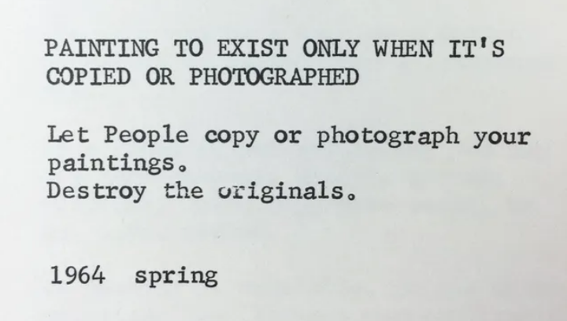

### Developing Concept: Social Glitch 

[Glitch art](https://en.wikipedia.org/wiki/Glitch_art).    
[Garfinkle's reaching experiments](https://en.wikipedia.org/wiki/Breaching_experiment)  
[Yoko Ono's Grapefruit](https://en.wikipedia.org/wiki/Grapefruit_(book))    

In pairs, consider the themes explored in the works from the lecture. (intimacy across distance, designing with strict constraints, introduction of other intelligences/agencies, collective memory, experimental collaboration, social glitch).

Discuss one of these themes and spend 15 minutes ideating several event scores (simple instructions or prompts) in the tradition of Yoko Ono's grapefruit or Garfinkle's breaching experiment. You should be aiming to do one or more of the following: 

* reveal, trouble or break a social convention  
* shift your perspective on communication or conversation  
* attune your attention to an interaction or social protocol that is taken for granted or overlooked    
* defamilarize or estrange communication (eg. with a social convention, your device, a platform, an app etc.) 

For example: 
"Swap phones with a friend for 24 hours"

Your prompts should be small gestures that can be described in a one sentence instruction. Brainstorm a list in your groups. Once you have these, discuss how you could take such a prompt and use it as the basis for a project or software interface. Come back and share whichever prompt that was most interesting to you. 

*Exercise inspired by Lauren Mccarthy and Kyle McDonald. See their class for further examples and resources on social hacking: [Appropriating Interaction Technologies](https://github.com/lmccart/SocialHacking)*
