## Introduction to Telematic Art and Experiments in Connection

*This lecture is prepared from collaborative research with legendary Carnegie Mellon Prof. Golan Levin. We have written [this book](https://mitpress.mit.edu/books/code-creative-medium) on computational art together.*

### Collective Memory & Experimentatal Collaboration

##### Cairns

A cairn is a human-made pile of stones, often accreted over the course of centuries. Since prehistoric times, these collaboratively
produced structures have served as landmarks, trail markers, and memorials. They demonstrate asynchonous collaboration.

##### Your World of Text

Andrew Badr's Your World of Text is an infinite grid of text editable by any visitor. "The changes made by other people appear on your screen as they happen. Everyone starts in the same place, but you can scroll through the world using your mouse. Put any letters at the end of the URL to go to a new world. For example, http://yourworldoftext.com/forexample. They all start off blank. You can also create a custom world for you and your friends."

...and here?

[https://www.yourworldoftext.com/](https://www.yourworldoftext.com/)

##### Telegarden (1995)

Ken Goldberg & Joseph Santarromana's TeleGarden is a classic media art installation that allows web users to view and interact with a remote garden filled with living plants. Members watch the garden reomotely and can plant, water, and monitor the progress of seedlings via the tender movements of an industrial robot arm. The Telegarden was developed at the University of Southern California and went online in June 1995. In its first year, over 9000 members helped cultivate. In September 1996, the Telegarden was moved to the lobby of the Ars Electronica Center in Austria, where it remained online until August 2004.

[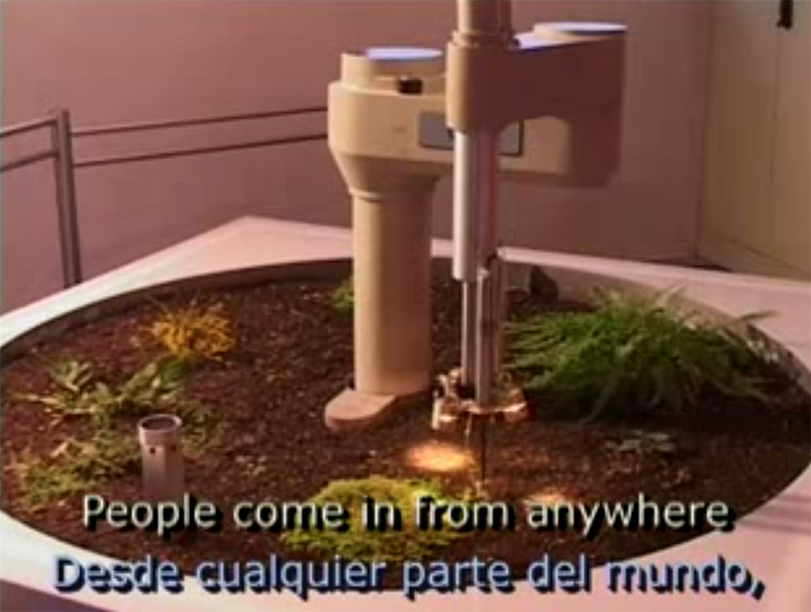](https://youtu.be/BCEC1tfc5Jc)

##### The Smaller Picture (2002)

The Smaller Picture (2002) by Kevan Davis is one of the first massively crowdsourced Internet artworks, and is still operational at https://kevan.org/smaller.cgi, but the best part is no longer there — an emergent alphabet created by the hive mind.

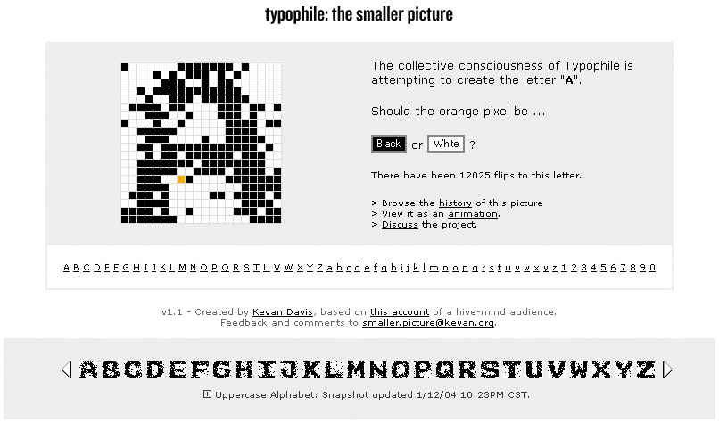

### Communication across distance 

##### Hole in Space (1980)

Hole in Space (1980) was a "communication sculpture" by Kit Galloway and Sherrie Rabinowitz, which used live two-way video to connect street-level audiences in Los Angeles and New York City.

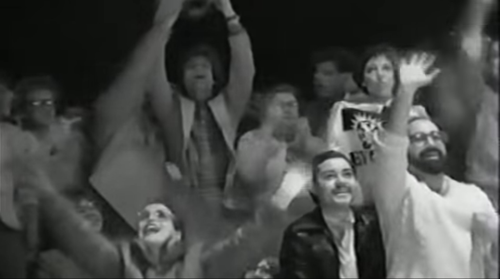

##### The Trace (1995)

In The Trace (1995), an interactive installation by Rafael Lozano-Hemmer, a participant encounters the moving, ghostlike "presence" of another person, who is located in an identical but separate room. Their presence is conveyed by a glowing spot created by a pair of intersecting beams of light.

##### Can We Talk? (2011)

Zach Gage's Can We Talk?(2011) "is a chat program for having serious conversations. It attempts to disambiguate the reasons for silence in online conversation, while preserving the qualities that make text chatting a unique platform for communication." (Gage)

[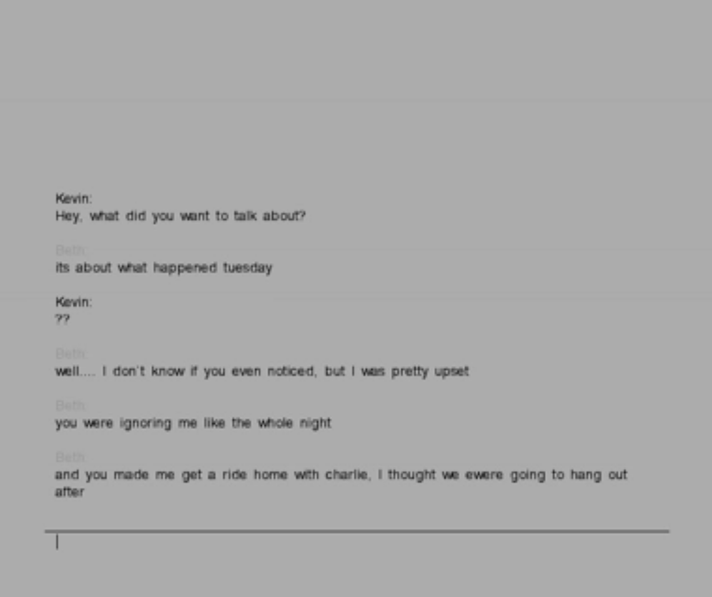](https://vimeo.com/27421540)

### Glitching Communication

*How might you celebrate the glitches in communication (See Menkman's Glitch Manifesto)*

Rosa Menkman's [Glitch Studies Manifesto](https://beyondresolution.info/Glitch-Studies-Manifesto) warns that the endless search for a noiseless channel is “no more than a regrettable, ill-fated dogma”. The manifesto goes on to define glitch as disintegration, and as such it is the flipside of synthesis and is a positive disruptor in both art and culture.

##### Telephone Picture (László Moholy-Nagy, 1923)

The first use of telecommunications as an artistic medium occurred in 1923 when the Hungarian constructivist artist László Moholy-Nagy made Telephone Pictures. These works questioned the idea of the isolated individual artist and the unique art object.

"In April 1923, Moholy had Construction in Enamel 2 and 3 made at a local enamel factory. He would later claim to have ordered them by describing them over the telephone, exaggerating both his distance from the manufacturing process that produced them and the degree of technological mediation involved. In doing so Moholy presented the artist in the modern age as producer of ideas rather than things. While sharing the same abstract geometric composition, the works use a mathematical progression to change its scale, highlighting the conception of the image as transferable data." (MoMA)

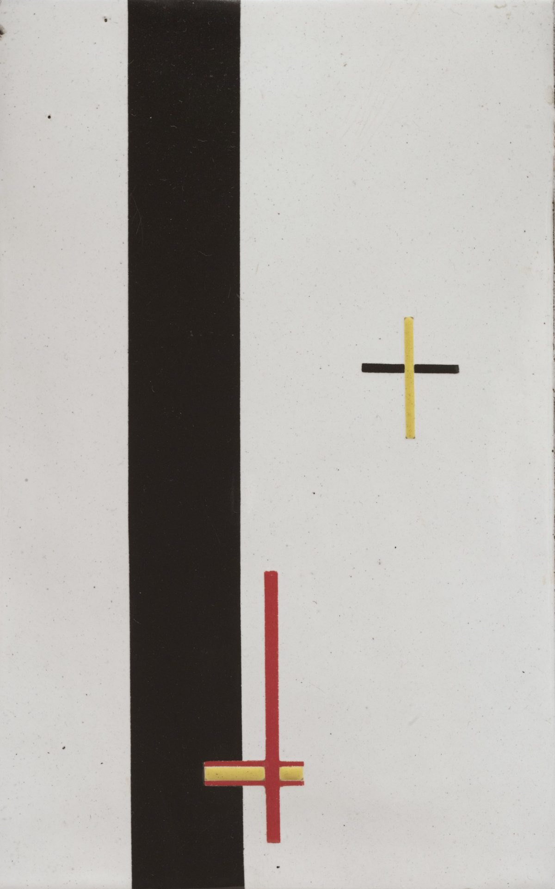

##### Somebody By Miranda July

[Somebody is a human](http://somebodyapp.com/) in the loop messaging app. The work exists as an app and a [short film.](https://vimeo.com/105256055)

##### MWITM (Man / Woman In The Middle)

Lauren McCarthy and Kyle McDonald play with the concept of a computer security attack called a "man in the middle attack", where the attacker secretly relays and possibly alters the communication between two parties who believe they are directly communicating with each other. In this case, they set up a system to MITM attack their own relationship. Their texts to each other were intercepted by a server and it had the ability to: modify a message as it is being sent or received, reply to a message instead of modifying or relaying it, and initiate new conversations without any actions from Lauren or Kyle.

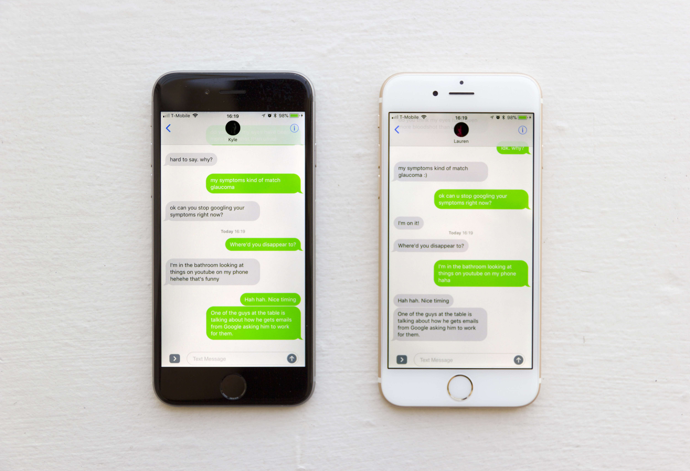

### The Joy of Low Bandwidth

*How might you explore and celebrate constraints/limits?*

##### the space between us (2015)

the space between us (2015) by David Horvitz is an iOS app which connects two people's phones. Once connected, the app displays the distance and direction to the other person. [Here is a nice essay on it by Paul Soulellis.](https://rhizome.org/editorial/2015/dec/09/space-between-us/)

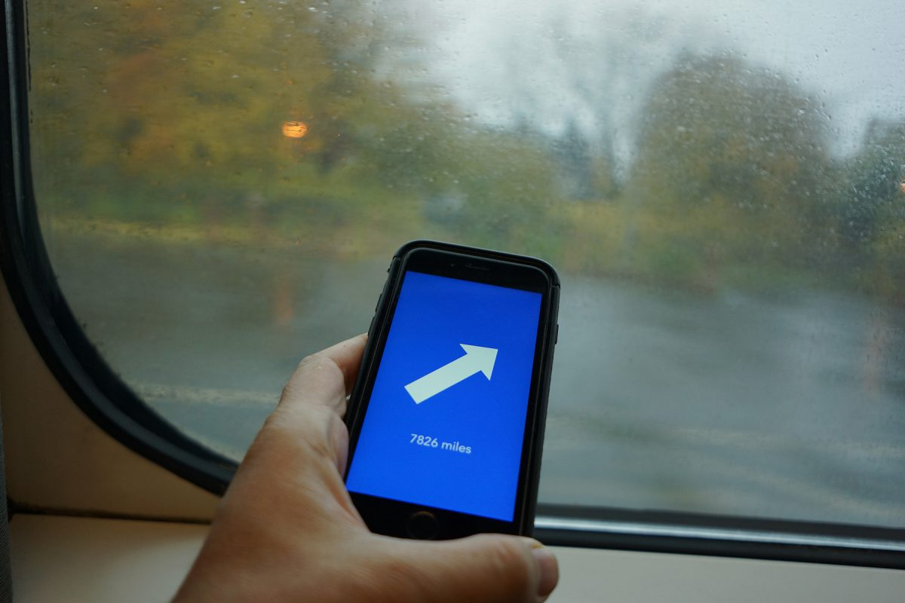

##### Die With Me 
Dries Depoorter and David Surprenant developed [Die With Me](http://diewithme.online/), a chat app you can only use when you have less than 5% battery. "Die together in a chatroom on your way to offline peace."

[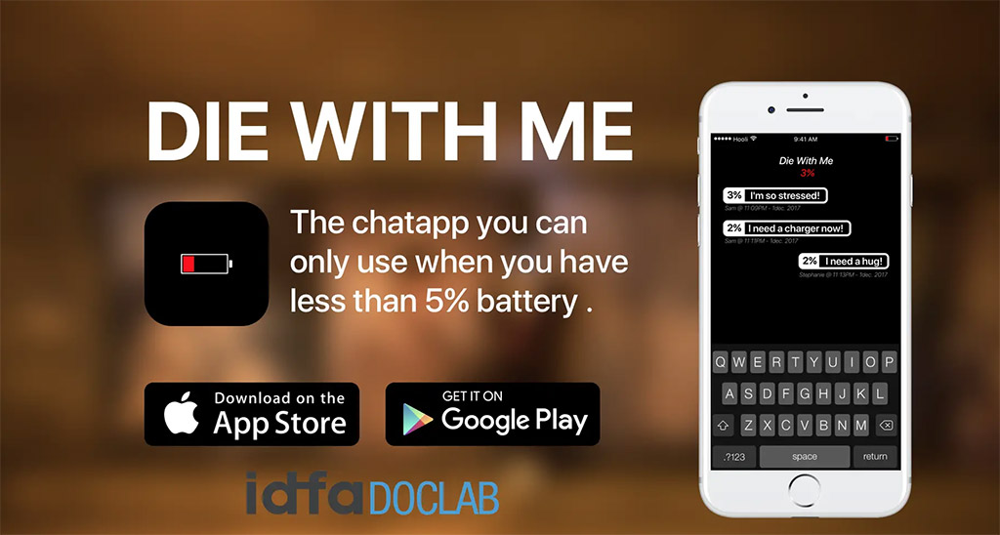](https://vimeo.com/251322259)

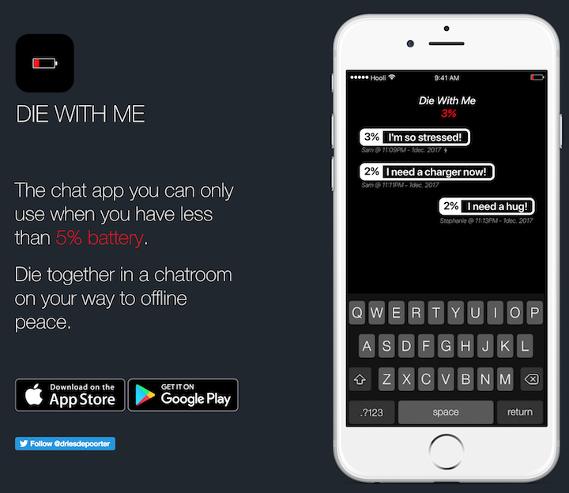

##### Thumbkiss / Couple (2018)

Another network-for-two is "[Thumbkiss](https://www.youtube.com/watch?v=NkveWyiU4Go&t=1m47s)" (recently renamed "Couple"). Couples in remote locations align their thumbprints in a shared, 2D virtual screenspace. 

[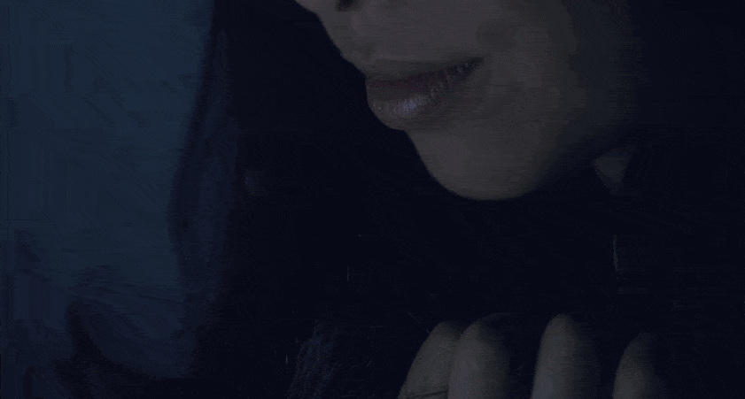](https://www.youtube.com/watch?v=NkveWyiU4Go&t=1m47s)

##### Dead Drops (2010-ongoing)
[Dead Drops](https://arambartholl.com/dead-drops/) started in 2010 as an ongoing participatory project at five different public spaces in New York. USB flash drives are embedded into walls, buildings, and curbs and are accessible to anybody. Each dead drop is installed empty except for a readme.txt file explaining the project. Everyone is invited to drop or find files on a dead drop. 

##### Roll Your Own Social

Darius Kazemi has spent a long time considering the rules of social media platforms, work that has inspired a plethora of experiments running small scale social media spaces with different rules and codes of conduct. Read about it: [https://runyourown.social/](https://runyourown.social/)

A particularly hilarious example is Dolphin Town where you can only converse in the sound of dolphin. [https://dolphin.town/about](https://dolphin.town/about)

### Exploring Other Intelligences

What other intelligences can we draw on or attend to in social spaces? Those lost to the past? Those of the crowd? Those that resist digital mediation?

##### Sandy Speaks (2017)

American Artist’s installation Sandy
Speaks (2017) explores the possibilities of
chat from beyond the grave. Using a customtrained
AI chatbot, this project places a visitor
in conversation with the real words of Sandra
Bland, who discussed racism and police
brutality in an extensive series of YouTube
videos just weeks before her own death in
police custody.

[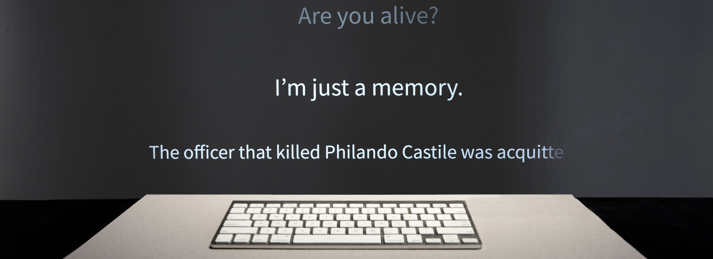](https://americanartist.us/works/sandy-speaks)

##### Social Turkers (2013)

Lauren McCarthy's Social Turkers (2013) asks: "What if we could receive real-time feedback on our social interactions? Would unbiased third party monitors be better suited to interpret situations and make decisions for the parties involved? How might augmenting our experience help us become more aware in our relationships, shift us out of normal patterns, and open us to unexpected possibilities? I am developing a system like this for myself using Amazon Mechanical Turk. During a series of dates with new people I meet on the internet, I will stream the interaction to the web using an iPhone app. Turk workers will be paid to watch the stream, interpret what is happening, and offer feedback as to what I should do or say next. This feedback will be communicated to me via text message." (McCarthy)

##### Smell Dating (2016)

Tega Brain and Sam Lavigne created a smell based dating service for one hundred people in New York City. Participants were sent a shirt, asked to wear it for three days and return it. They were then sent 10 annonymous samples of other participant's t-shirts from which to choose dates. 

[Smell Dating Website](http://smell.dating/)

